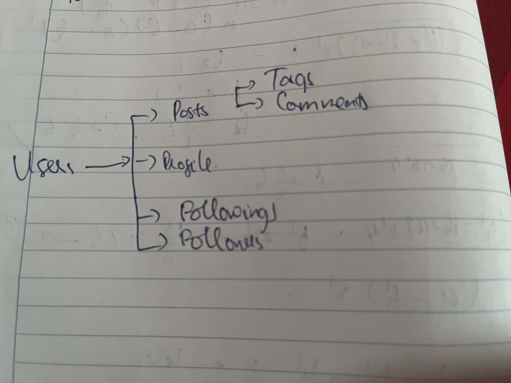

Resource : users ,profiles ,posts,comments ,tags,followers,following

collection : posts, tags, users
item: users/{user_id}, posts/{post_id}
sub-resource : posts/{post_id}/comments, users/{user_id}/followers

3. Sơ đồ phân nhánh 

endpoints hiện tại:
tất cả đều là v1/

posts:

GET /posts
POST / posts
PUT /posts
PATCH /posts
DELETE /posts

comments:

GET /post/{post_id}/comments/
POST /post/{post_id}/comments/
