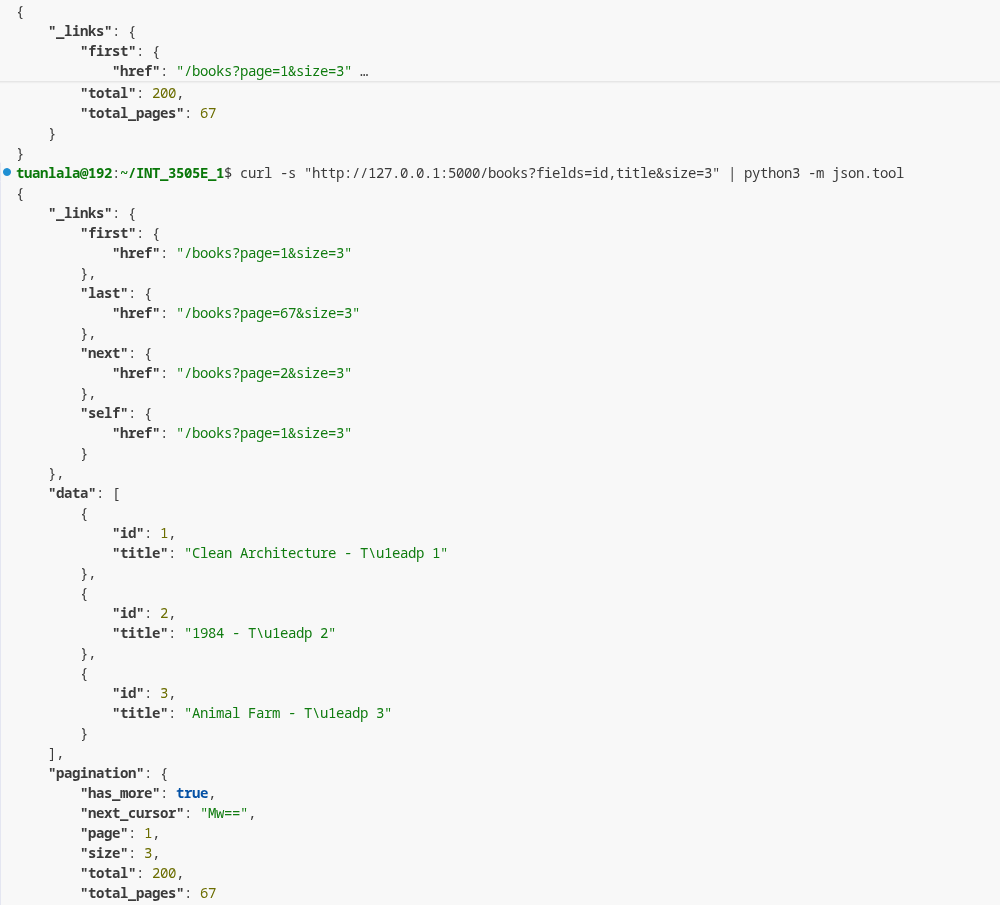

Kết quả chạy sử dụng cursor , 
khi query sẽ là
``` sql
 SELECT * FROM books WHERE id > 3 LIMIT 4
 ```
1 kĩ thuật mà gemini nói rằng sử dụng nó để biết rằng còn trang sau hay không , nếu có cuốn số 4 nghĩa là vẫn còn , thay vì phải query thêm 1 lần nữa 


Kết quả khi chạy filer 
câu lệnh tương ứng khi repos chạy là 
``` sql
SELECT * FROM books 
WHERE LOWER(author) = 'george orwell' 
LIMIT 3 OFFSET 0;
```


Kết quả khi chạy với sort
câu lệnh query là 
```sql
SELECT * FROM books 
ORDER BY published_year DESC 
LIMIT 3 OFFSET 0;
```


Kết quả của parsed fieldsets:
riêng cái này phải xử lí tại services , khi này để tiết kiệm băng tông nó sẽ giữ lại các fields cần thiết trước khi trả về 
Vậy tại sao không select Fieldsets? Theo em tìm hiểu là nó sẽ giúp ta phục vụ các logic ngầm như cursot pagination , như ở vd 1 có đề cập cần trường id để giảm số luongj request
Cái thứ 2 là tránh được sql injection, bỏ đi sử dụng f"string" để khớp , giúp giảm thiểu nguy cơ bị tấn công 
1 cái nữa là keep it simple 
giữ repo đơn giản dễ hiểu , không cần xử lí phức tạp 
Tuy nhiên với các hệ thống lớn thì  gehihi có nói rằng việc select fields là bắt buộc thì data cực lớn , và ta luôn có thể tận dụng index bằng cách select cả index

đây là 1 trade off 
và giải pháp tối ưu đựoc đưa ra là  Tầng Repo sẽ whitelist các trường an toàn, luôn ngầm ép SELECT id, <fields_yêu_cầu> ở Database, sau đó tầng Service dùng id để phân trang rồi mới loại bỏ id nếu client không yêu cầu.
